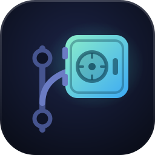

<!-- AI-CONTEXT: .ai/rules.md -->
<p align="center"></p>

# Context Bank

[](https://www.npmjs.com/package/context-bank)
[](https://www.npmjs.com/package/context-bank)
[](LICENSE)

**Your memory bank is eating your context window.** Context Bank keeps AI project memory small, in git, and shared by every tool your team uses.

Memory-bank setups tell the agent to read every file at the start of every task and to append after every change. Banks grow without limit and each session pays for all of it. Context Bank inverts that: capped live files, decisions kept one per file and searched instead of preloaded, and a `doctor` command that measures the damage.



```bash
npx context-bank init      # new project
npx context-bank doctor    # measure an existing bank
```

Works with anything that reads **`AGENTS.md`**: Claude Code, Codex, Cursor, Copilot, OpenCode, Gemini CLI, Grok.

## Real numbers

Four real banks that grew under the old contract ("read rules, active-context and roadmap before every task; update four files after every task"), before and after `context-bank migrate --compact` (3.0.0). Same three files on both sides. Tokens are estimated as characters / 4.

| Project | Read at session start before | Same files after | Whole bank before (incl. story, architecture) | Decisions after (one file each) |
|---|---:|---:|---:|---:|
| Web app A | ~241k tokens | ~5k tokens | ~435k tokens | 457 |
| Web app B | ~119k tokens | ~5k tokens | ~229k tokens | 167 |
| Workflow service | ~36k tokens | ~5k tokens | ~81k tokens | 130 |
| Mobile app | ~31k tokens | ~4k tokens | ~58k tokens | 66 |

After migrating, only `rules.md` and `active-context.md` (~2-3k tokens) are read every session; `roadmap.md` is read when planning. Nothing is deleted: overflow is copied into `.ai/archive/`, and `.ai/story/` stays searchable.

## How it compares

| | Context Bank | Cline Memory Bank | Plain `AGENTS.md` / `CLAUDE.md` | Native tool memory |
|---|---|---|---|---|
| Lives in git, reviewed in PRs | Yes | Yes | Yes | No, per user and per machine |
| Shared by the whole team | Yes | Yes | Yes | No |
| Works across tools | Yes, via `AGENTS.md` | Built for Cline | Yes | No, one tool only |
| Loaded per session | Small capped files | Every file, every task | The whole file | Tool decides |
| History | `.ai/story/`, one file per decision, searched on demand | Grows inside the loaded files | None, or grows inside the file | Opaque |
| Size limits and measurement | Caps + `doctor` | None | None | None |
| Cleanup tooling | `compact`, `migrate` | Manual | Manual | Manual |

## The files

| File | Role |
|---|---|
| `.ai/rules.md` | Always read. Stack and conventions. Keep small. |
| `.ai/active-context.md` | Current work only (~80 lines). |
| `.ai/roadmap.md` | Open work. Read when planning. |
| `.ai/architecture.md` | Current shape, not a changelog. Read when structure matters. |
| `.ai/story/` | Rare decisions, one file each (`YYYY-MM-DD-slug.md`). **Do not preload.** Search it. |

`AGENTS.md` carries the contract, so every tool that reads it gets the same instructions. Claude Code gets a thin `CLAUDE.md` that imports it (`@AGENTS.md`).

## Claude Code plugin

```bash
claude plugin marketplace add kadiresen/context-bank
claude plugin install context-bank@context-bank
```

Adds a `context-bank` skill (which file to read when, when to write, what never to write), a quiet session-start `doctor` check that only speaks up when something is wrong, and `/context-bank:doctor`, `/context-bank:compact`, `/context-bank:init`. Details in [plugin/README.md](plugin/README.md).

## Agent Skills (Codex, Cursor, Gemini CLI, OpenCode, ...)

The skill follows the [Agent Skills](https://agentskills.io) standard and uses only its standard frontmatter fields. To use it outside the plugin, copy [`plugin/skills/context-bank/`](plugin/skills/context-bank/SKILL.md) into your tool's skills directory (for Claude Code without the plugin: `.claude/skills/`).

## New project

```bash
npx context-bank init
```

Default writes `.ai/` + `AGENTS.md` + a thin `CLAUDE.md`. Cursor/Windsurf/Copilot/Aider/Gemini pointer files are opt-in:

```bash
npx context-bank init --legacy-pointers
```

`init` never overwrites an existing `.ai/` file or `AGENTS.md`. It is **not** an upgrade path.

## Upgrading an existing bank

`init` will not upgrade you. For a v1 bank (the every-task contract) or a 2.x bank (one growing `story.md`), run:

```bash
npx context-bank migrate             # move the bank to v3
npx context-bank migrate --compact   # also archive overflow into .ai/archive/ (copy, not delete)
```

`migrate`:

- replaces the old contract in `AGENTS.md` and `CLAUDE.md` and keeps any custom sections in them; a file that has to be rewritten whole is first copied to `.ai/archive/`,
- splits `story.md` (and story entries an earlier `compact` archived) into one file per decision under `.ai/story/`, without losing a line,
- is safe to run twice.

Then skim `.ai/story/`, `.ai/active-context.md` and `.ai/archive/`. `architecture.md` stays as-is if it is over the size cap; `doctor` will warn. Until a 2.x bank is migrated, `doctor` reports `legacy-story`.

## Coming from Cline Memory Bank

`migrate` detects `memory-bank/` and converts it:

```bash
npx context-bank migrate --compact
```

| Cline file | Goes to |
|---|---|
| `techContext.md` | `.ai/rules.md` (always read, kept small) |
| `projectbrief.md`, `productContext.md`, `systemPatterns.md` | `.ai/architecture.md` (read when structure matters) |
| `activeContext.md` | `.ai/active-context.md` |
| `progress.md` | `.ai/roadmap.md` |

The whole `memory-bank/` folder, extra docs included, is copied to `.ai/archive/cline-memory-bank/`; nothing is deleted and existing `.ai/` files are never overwritten. A dedicated `.clinerules/memory-bank.md` is backed up and replaced with a short pointer to `AGENTS.md`, so Cline stops reading every file on every task. After you review `.ai/`, delete `memory-bank/`; `doctor` reminds you until you do.

## Commands

```bash
context-bank doctor              # size caps, leftover v1 contract or 2.x story, stale markers
context-bank compact             # archive active-context and roadmap overflow into .ai/archive/
context-bank compact --dry-run
context-bank migrate
context-bank migrate --compact
```

`init`, `compact` and `migrate` accept `--yes` to skip the confirmation prompt (useful in scripts and CI).

## Use as a library

The package also exports its logic, so other tools can read and maintain a bank without shelling out to the CLI: `initializeBank`, `diagnose`, `migrateBank`, `compactBank`, `bankVersion`, `addDecision`, `listDecisions` and `searchDecisions`. Library functions never print or exit; they return results.

```ts
import { addDecision, searchDecisions, diagnose } from "context-bank";

await addDecision(root, { title: "Use Postgres, not Mongo", body: "Reports need joins." });
const { entries } = await searchDecisions(root, "postgres"); // [{ path, text }]
const { ok, findings } = await diagnose(root);
```

`addDecision` writes `.ai/story/<date>-<slug>[-<suffix>].md` and returns `{ path, date, title }`. Options:

- `date`: `YYYY-MM-DD`; defaults to today (UTC).
- `suffix`: a branch- or session-unique token (letters, digits and dashes, up to 32 characters) so two branches that add the same decision on the same day do not collide in git. Leave it out for no suffix; `""` is invalid. If the name is still taken, `-2`, `-3`, ... is added on top.

It throws when the title is empty or the whole file (title, date line and body) would exceed 4,000 characters.

## License

MIT © [Kadir Esen](https://github.com/kadiresen)
